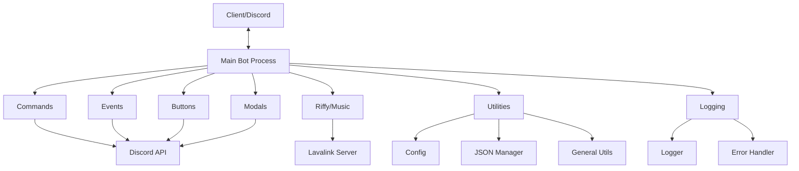
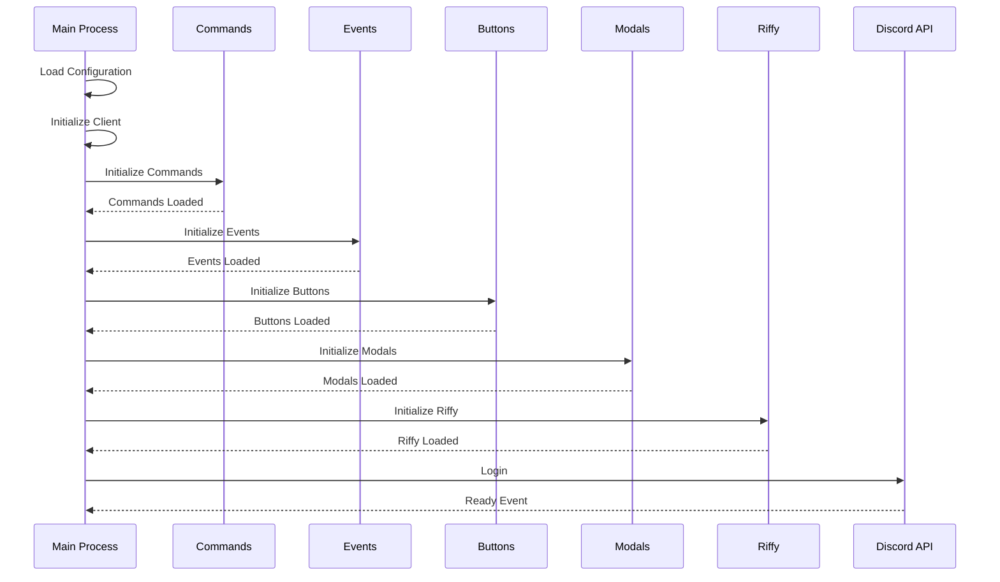
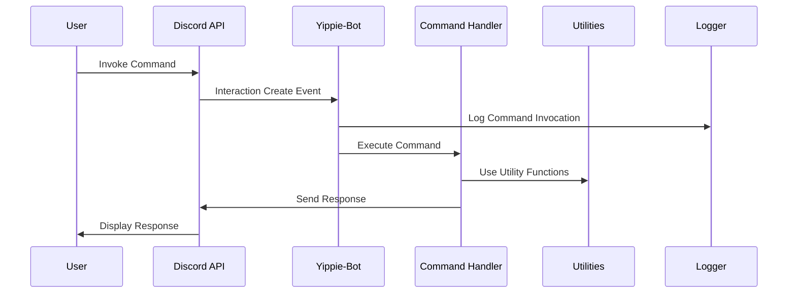
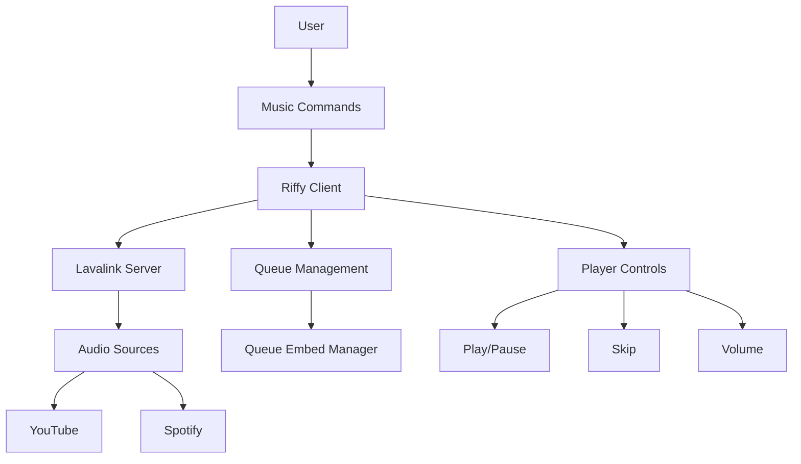
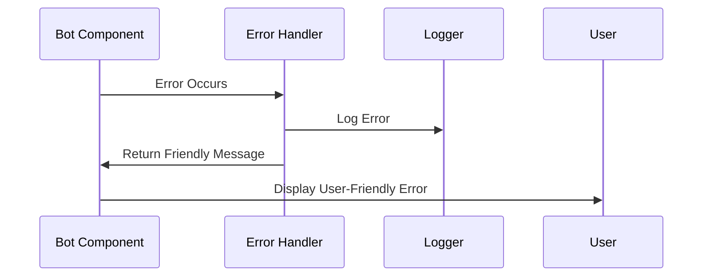

# Yippie-Bot Architecture Documentation

This document provides an overview of the Yippie-Bot architecture, including component relationships and data flow.

## Component Architecture

## Initialization Flow

## Command Execution Flow

## Music System Architecture

## Error Handling Flow

This architecture documentation provides a high-level overview of the Yippie-Bot system. For more detailed information about specific components, please refer to the JSDoc documentation in the source code.